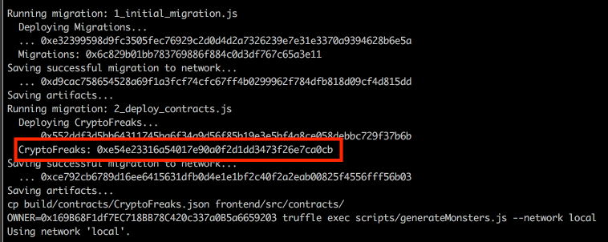
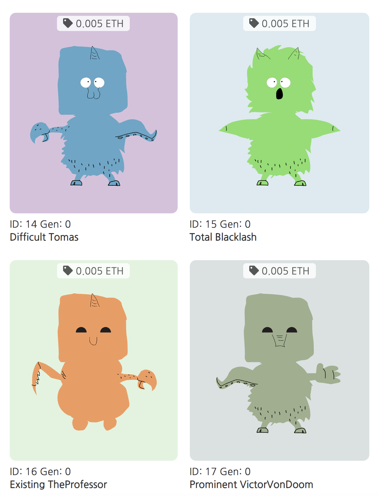
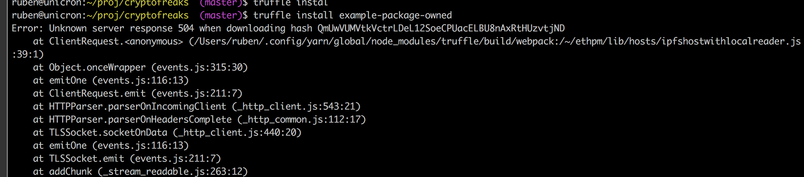

## Collectible.
## Tradeable.
## Horrible.

### Collect and trade digital creatures

This is a game centered around tradeable and collectible monsters. 
Each monster is one-of-a-kind and 100% owned by you; it cannot be replicated, taken away, or destroyed.

You can buy, sell and gift cryptofreaks to other players

# Instructions

## How to run locally 

Make sure you have all the necessary tools installed: truffle, yarn/npm, ganache-cli 

1. Run your own local ethereum network using Ganache. Copy the first account address, to be used as owner. 
2. Clone this repo and go to that folder for the next steps.
3. Delete `build` folder if present (for rebuilds)
4. Run `OWNER=<owner_address> make rebuild` to compile the contracts using truffle. Replace <owner_address> with the one you copied on the previous step
5. Copy the contract address generated during the deploy step (see image) this will be needed to setup the frontend
6. open `frontend/src/config.js` and copy the previous value for the constant `CONTRACT_ADDRESS`

7. from the `frontend` directory run `yarn install` and then `yarn start`. Then you should be able to test the app on your browser.
8. Make sure Metamask is connected to the local network (usually trough the RPC server: http://127.0.0.1:8545)
9. Similar to Cryptokitties, you will be able to browse monsters, buy them, sell them, and gift to other users (no breeding function at the time)  

## Run deployed version 

1. Switch Metamask to Rinkeby testnet
2. Go to https://cryptofreaks.herokuapp.com/

## Deployed address (Rinkeby)
CryptoFreaks: 0xb7f63b4c55870736eaabd4497942ed2c51da5094

## Clarification about ethpm

It was not possible to install the example-package-owned at this time:

Instead I used a openzeppelin's Ownable.sol which is equivalent.

